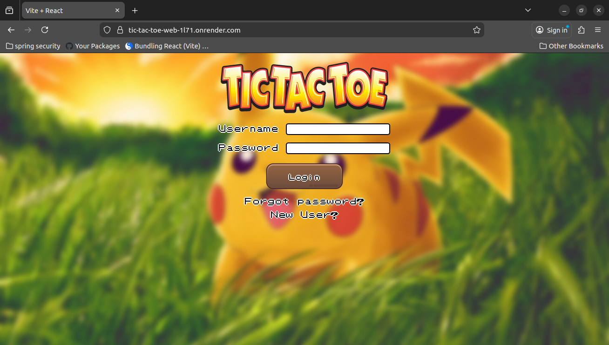
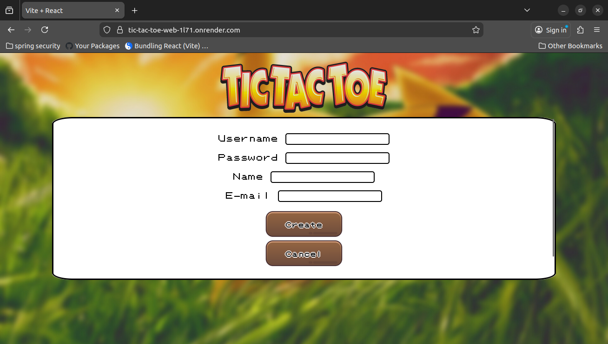
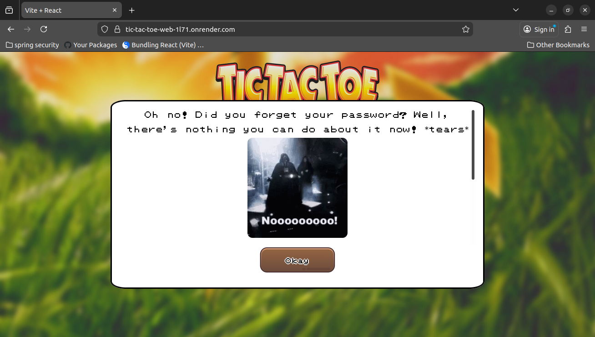
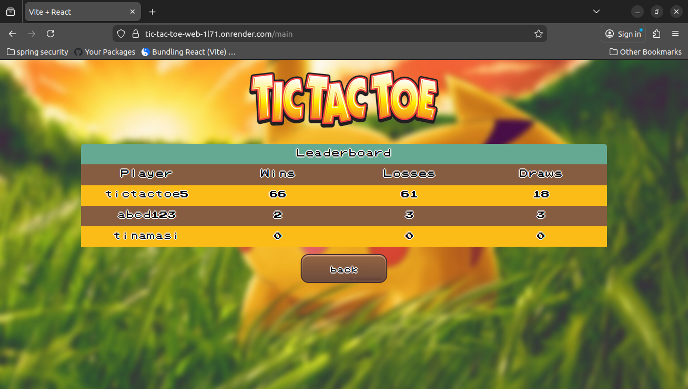
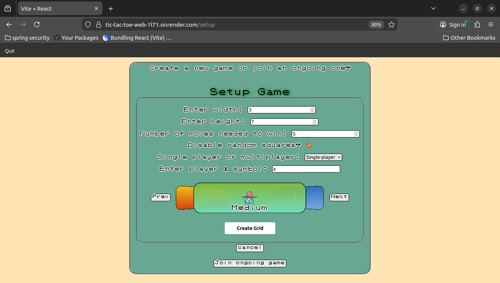
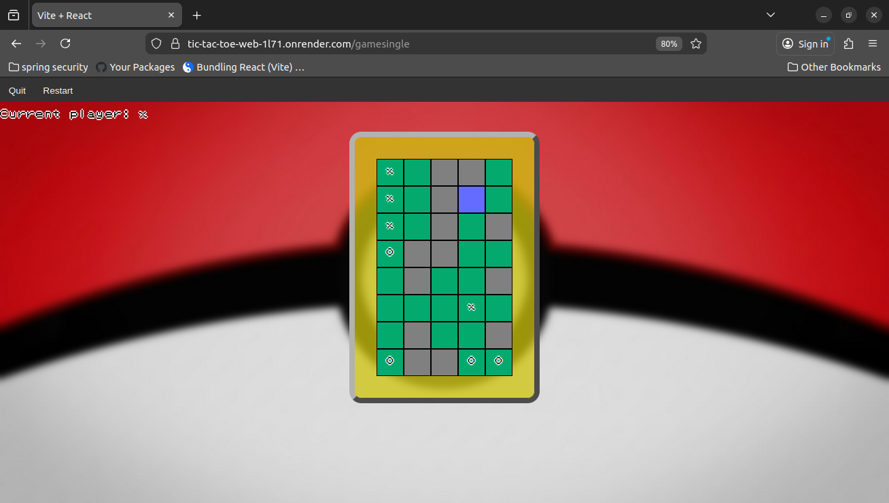
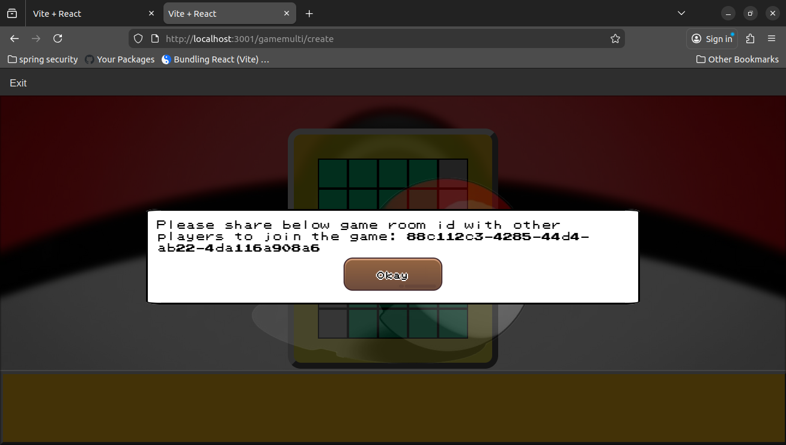
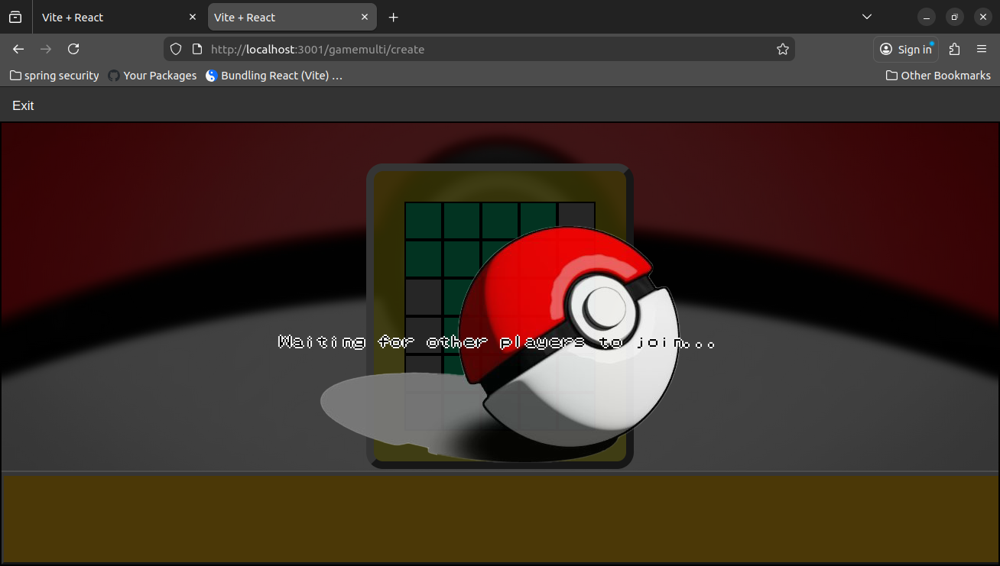
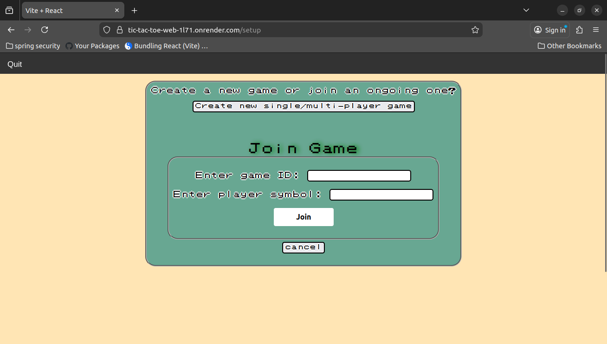
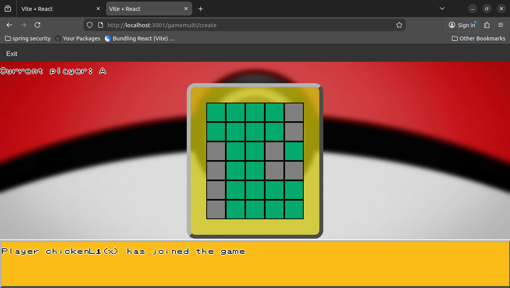

# Tic-Tac-Toe

## Built with:
- TypeScript
- JavaScript
- Node
- Express
- WebSocket
- MongoDB
- Vite
- Vitest

## Application Features
- **Dynamic game board size**: Users can select n x n board sizes (smallest allowed size is 3x3), and have the option to randomly disable some squares on the board at the start of the game  
- **Account verification**: New users can verify their accounts using links sent to their registered e-mail
- **Password Reset**: Users can reset their passwords using the links sent to their registered e-mail
- **Scoreboard**: Displays scores (wins/losses/ties) of all users
- **Single Player**: Users can play in single player mode with 3 difficulty levels
- **Multi Player**: Users can play online in multi-player mode by creating a new game or joining an existing one


## System Information
- **Account verification/Password Reset**: Newly created accounts are disabled by default. Account activation/password reset is performed using the link sent to the user's e-mail using **nodemailer** and **Gmail SMTP server**
- **Security**: Application uses **JWT** tokens to verify API requests 
- **Game Difficulty**: This has been implemented using the mini-max algorithm.
1. _EASY_: Computer makes a move randomly
2. _MEDIUM_: Computer randomly chooses between a randomized move and a move calculated using minimax algorithm
3. _HARD_: Computer plays moves only using minimax algorithm


## Bugs/drawbacks/to-dos:
* Not all moves of the minimax algorithm are evaluated (even with alpha-beta pruning). This has been done to (somewhat) lessen the time taken to return a played move to the user (to compensate for limited memory on free tier website hosting, and because the calculation is performed by a single process (due to JS being single-threaded)). However, this results in the following issues: 
1. In some instances, the computer does not return a valid move (it looks like the computer plays no moves and it is the user's turn to play again)   
2. The algorithm still does take more time when the board sizes are significantly larger 
* Ongoing game data is currently stored in the Node server
## Installation: 
- To start the app:
```
npm run start
```
- To run tests:
```
npm run test
```

## Screenshots

### Login


### Sign-up


### Forgot password


### Leaderboard


### Play single-player or create a multi-player game


### Playing single-player game


### Created a new multi-player game

   

### Join existing game


### Playing multi-player game



